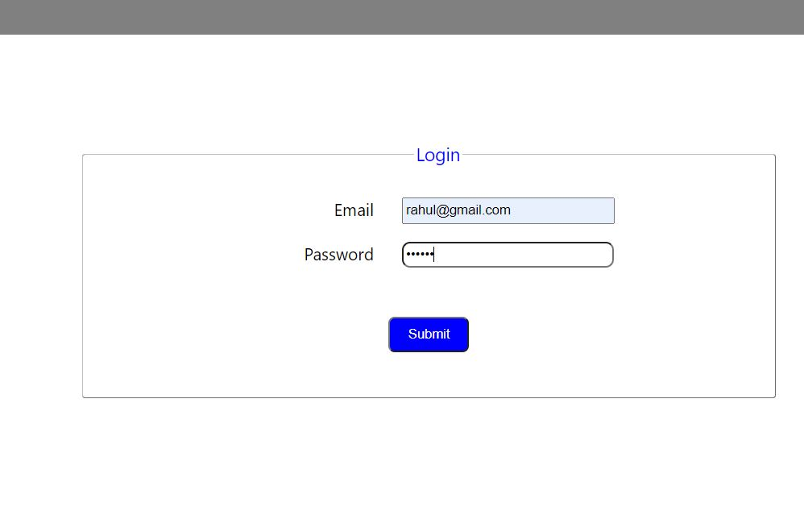
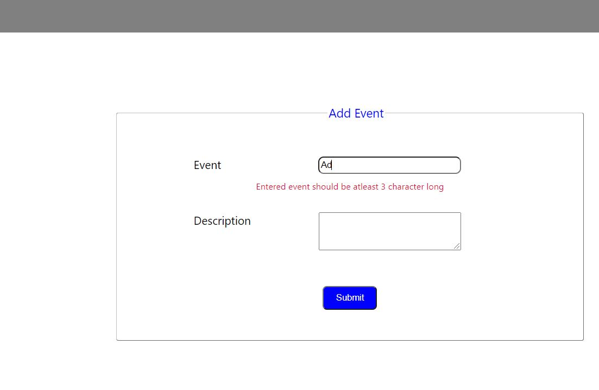
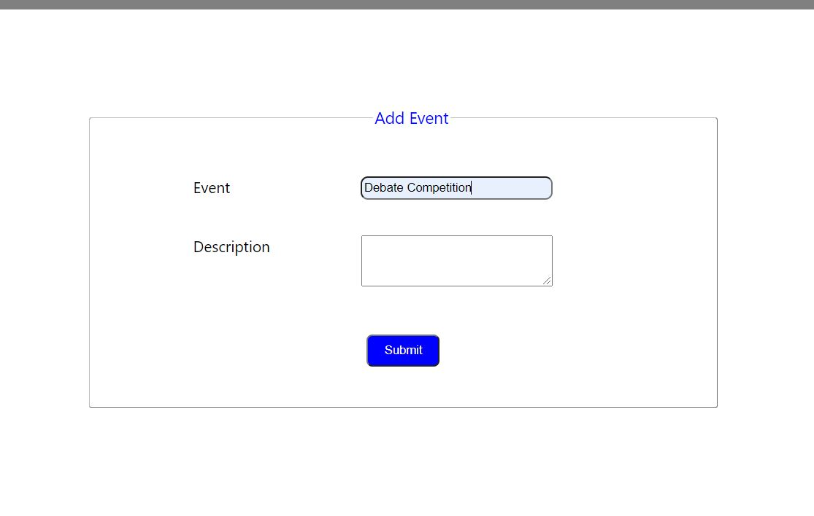

#  Event Organizer

## Technologies used
* HTML
* CSS
* JS
* Express Js
* React Js
* Node Js

### Features
* Signup
* Login
* Add new Event
* Event List

### Demo

  
  ## Signup
  

   
  
  ## Login
  
  
   
  
  
   
  
  .
  ## Add Event
  
   
  
  
   
  
  ## Event List
  
   

